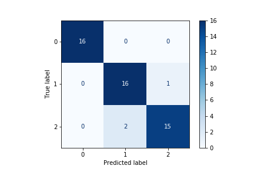
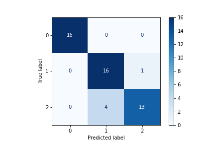

# sklearn Iris Tutorial
Introduction to classification techniques with sklearns iris dataset.

Notebooks create and analyze the Iris Classification data with sklearn.

Notebooks implement a logistic regression and a random forest classifier.

## Repo Goals

By completing these notebooks, you should be able to understand how to run classification with sklear, visualize results, compare models and select the best performing one using a given metric.

Notebooks rely on pandas, sklearn, joblib, seaborn and matplotlib libraries (see environment dir).

## Notebooks Overview

1. 1_Generate_Data
    * Imports data from sklearn
    * Saves data to csv files in 'data' dir
    * Has notes on environment setup (i.e., package versions) to complement the yml in the 'environment' dir
1. 2_Train_Test_Split
    * Imports data using pandas from csv files
    * Uses sklearn train-test split to create training and test datasets
    * Saves split data back into csvs in 'data' dir
1. 3_EDA
    * Imports training data only to conduct exploratory data analysis (EDA)
    * Visualizes data with seaborn pairplot
    * Has a method to explore column level data including number of unique values and value counts
1. 4_Train_Models
    * Trains two models on training data
        * Logistic Regression
        * Random Forest Classifier
    * Saves models using joblib to file
    * Calculates performance on training data using confusion matrices and classification report
1. 5_Predict_and_Evaluate
    * Loads trained models and test data
    * Runs predictions on test data
    * Evaluates performance by:
        * Visualizing confusion matrices
        * Calculating accuracy
        * Generating other metrics with a classification report

## Example Results

The two plots below show predicted vs. actual values for the train and test dataset for both models tested. Confusion matrices for both models are shown on the test set. 

### Logistic Regression Confusion Matrix

### Random Forest Confusion Matrix

